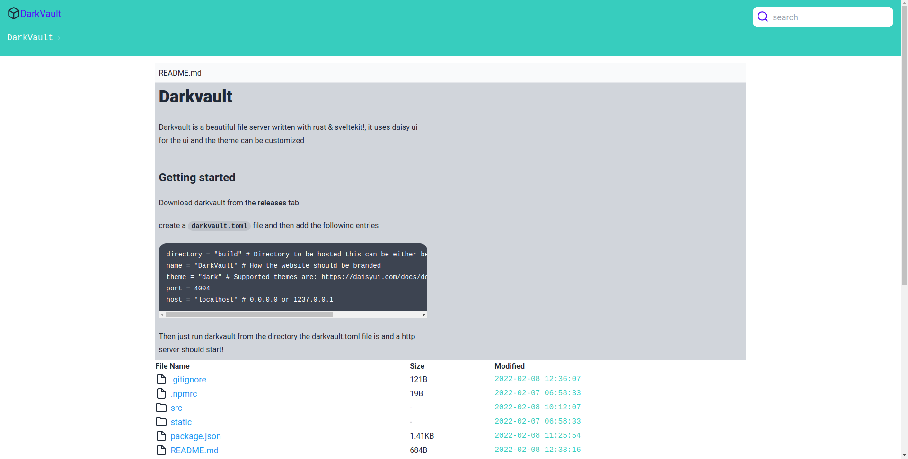
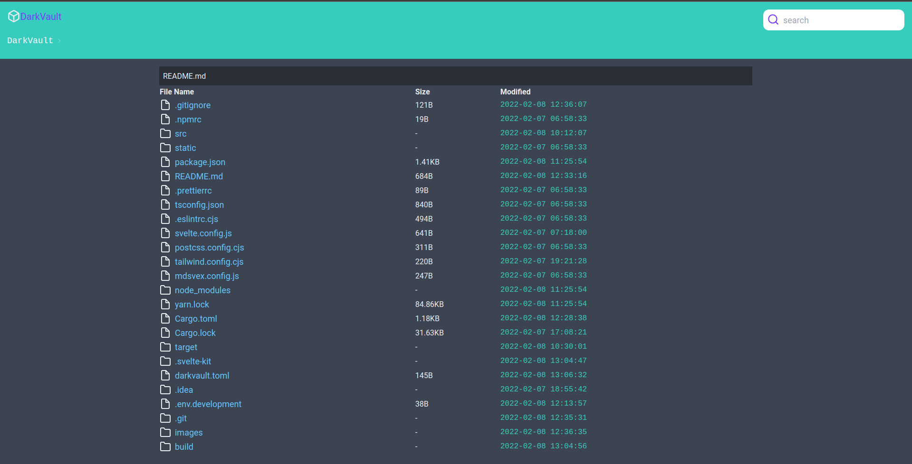

# Darkvault

Darkvault is a beautiful file server written with rust & sveltekit!, it uses daisy ui for the ui and the theme can be customized

## Getting started

Download darkvault from the [releases](TODO) tab

create a `darkvault.toml` file and then add the following entries

```toml
directory = "build" # Directory to be hosted this can be either be a relative path or a direct path
name = "DarkVault" # How the website should be branded
theme = "dark" # Supported themes are: https://daisyui.com/docs/default-themes
port = 4004
host = "localhost" # 0.0.0.0 or 1237.0.0.1
```

Then just run darkvault from the directory the darkvault.toml file is and a http server should start!

## Screenshots

| Light                   | dark                    |
| :---------------------- | :---------------------- |
|  |  |
